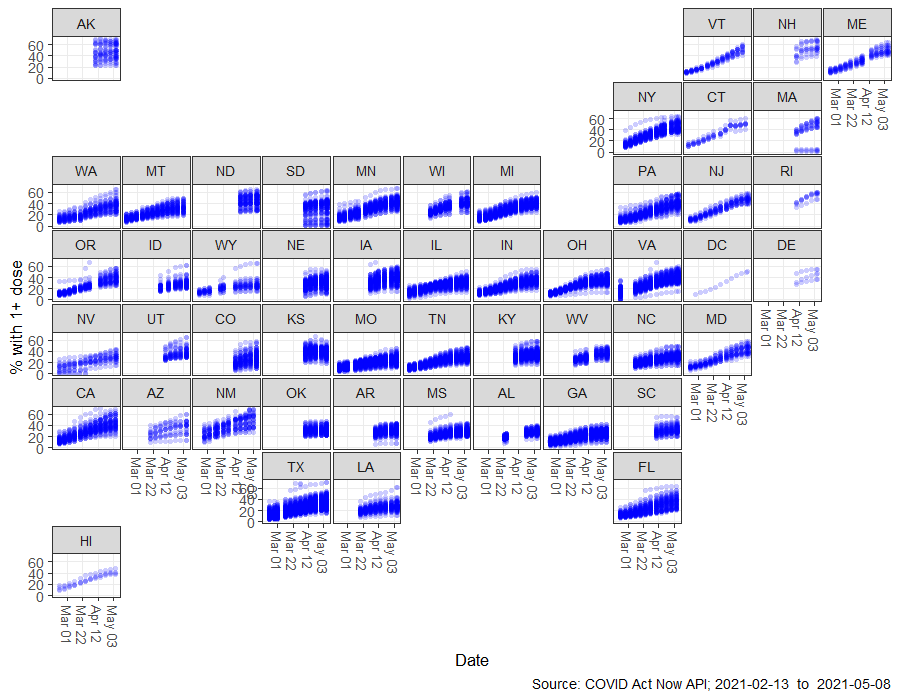
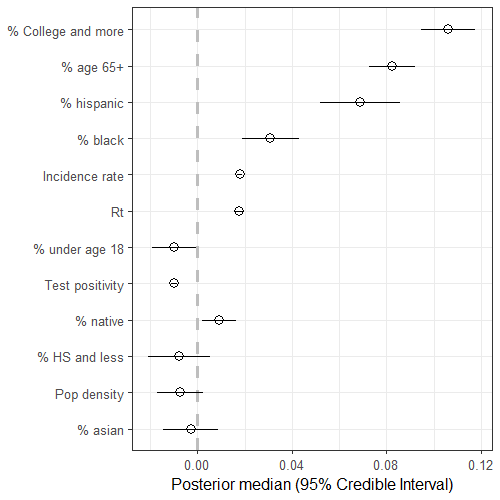
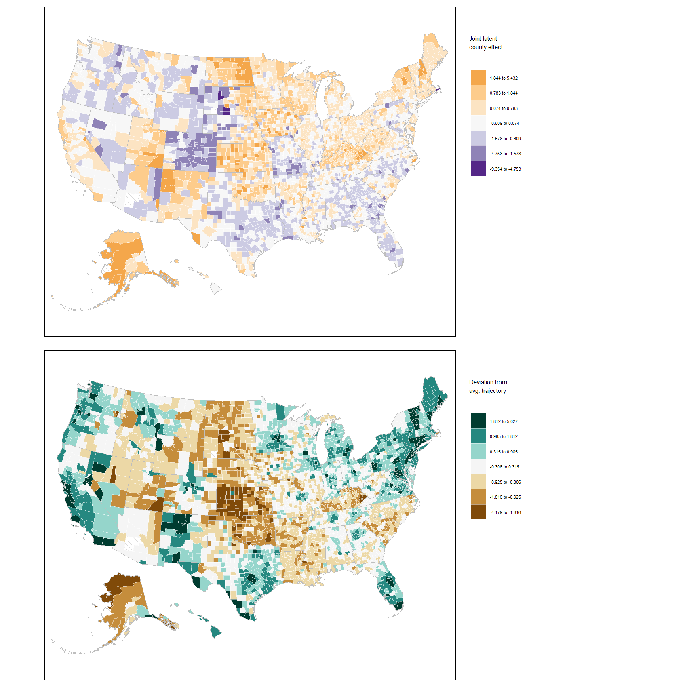
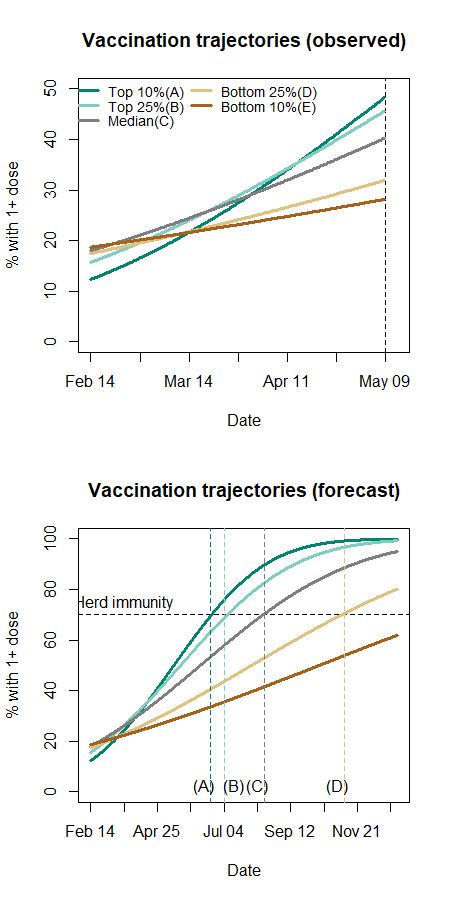
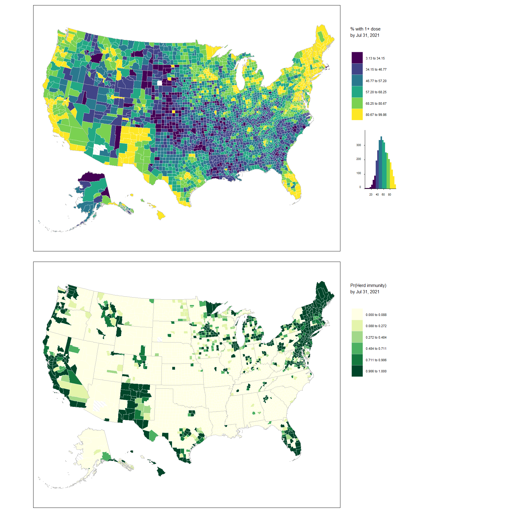

# COVID-19 Vaccination Progress by US County (2021)
This is a companion repository for the article submitted to the [International Journal of Epidemiology](https://academic.oup.com/ije) titled "COVID-19 vaccine uptake in United States counties: geospatial vaccination patterns and trajectories towards herd immunity" by Pavel Chernyavskiy, _author2_, and _author3_. A pre-print of our article is located [here]. 
In this repository we will provide:
1) updated versions of all figures using most recent vaccination data
2) links to interactive and clickable versions of the maps

This repository will be updated weekly, at least through the end of 2021. For inquiries please contact Pavel Chernyavskiy.

# May 8, 2021 UPDATE
Cumulative percentage of residents with at least one dose of the COVID-19 vaccine by county (Nc = 3137) and week (Nt = 13), February 13, 2021 through May 08, 2021. Each panel is labelled using a two-letter US state abbreviation. Each point plotted represents data for a county at the end of a given week. Some overplotting may occur; this may lead to an appearance of darker coloured points.

Estimated coefficients of time-fixed and time-varying US county effects from the selected spatio-temporal Beta regression model with a probit link, sorted by absolute magnitude. All covariates were centered and scaled prior to analysis.	

Standardized time-averaged joint (spatial + unstructured) county effects (top) and standardized deviations from the typical trajectory per US county (bottom). Values > 0 indicate a county is over-performing expectations under the model; values < 0 indicate a county is under-performing expectations under the model. Diagonal hatch pattern indicates missing data, which occurs for three counties: one in Alaska, one in Arizona, and one in South Dakota. An interactive and clickable version of this map is located [here] for the top panel and [here] for the bottom panel.

Fitted and forecasted trajectories for representative counties in the top 10%, top 25%, median, bottom 25%, and bottom 10% of estimated trajectories. Vaccination rates for the last 13 weeks of observed data (top) and forecasted rates through November 2021 (bottom) are shown. Dashed horizontal line indicates the herd immunity threshold of 70%. Counties in the top 10% of estimated trajectories are expected to reach herd immunity during Jun 21–27 (A); top 25% during Jul 5–11 (B); median county during Aug 16–22 (C); bottom 25% during Nov 8–14 (D); bottom 10% not during 2021. 

Forecasted percentage with at least one dose by US county for the week ending on July 31 (July 25 – 31) (top) and the estimated probability of herd immunity, i.e. Pr(prediction > 70%) (bottom). Diagonal hatch pattern indicates missing data. Diagonal hatch pattern indicates missing data, which occurs for three counties: one in Alaska, one in Arizona, and one in South Dakota. An interactive and clickable version of this map is located [here] for the top panel and [here] for the bottom panel.

