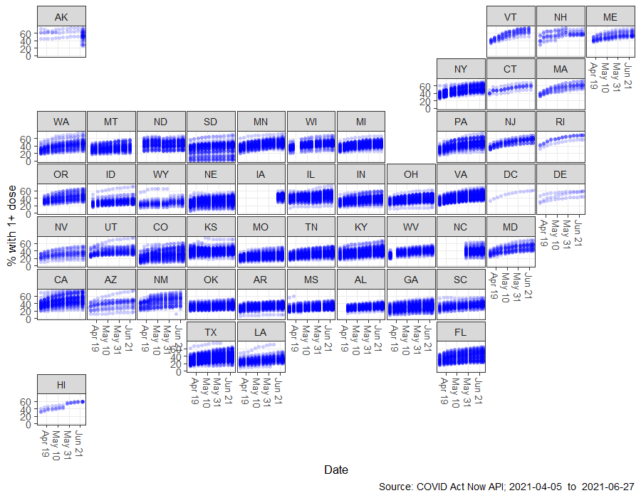
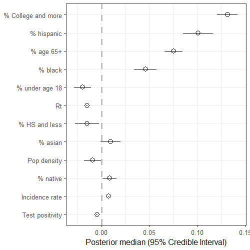
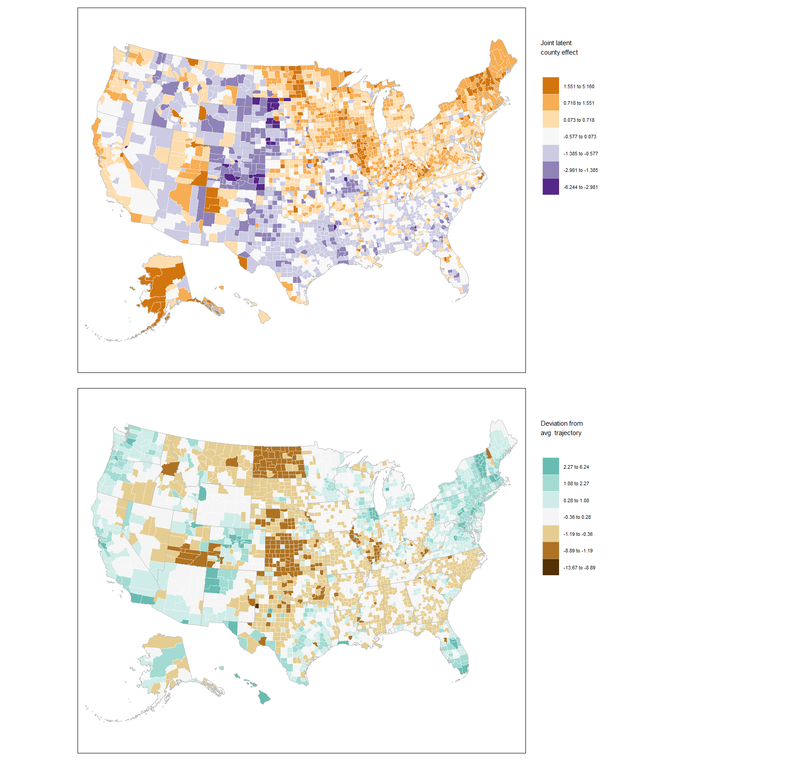
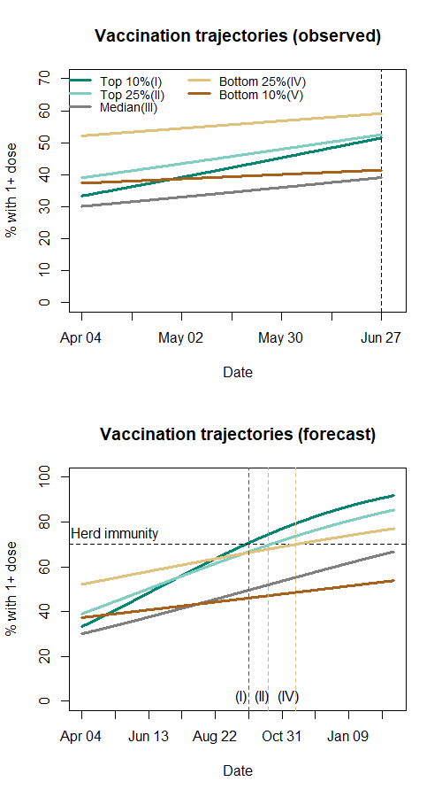
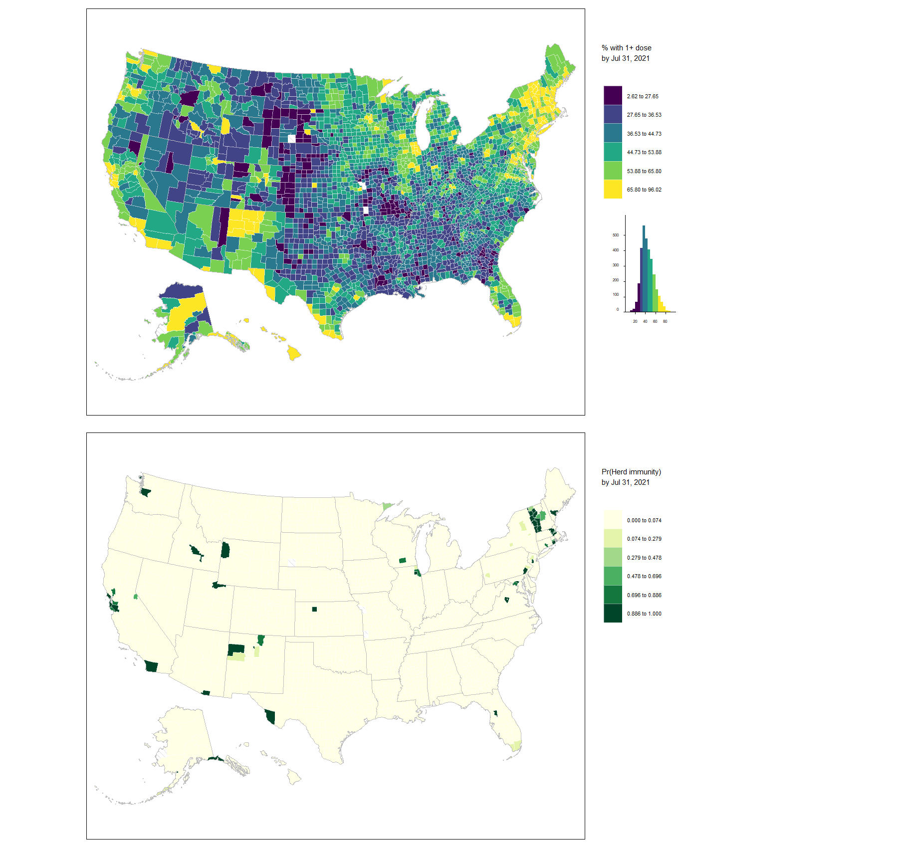

# COVID-19 Vaccination Progress by US County (2021)
This is a companion repository for the article titled "COVID-19 vaccine uptake in United States counties: geospatial vaccination patterns and trajectories towards herd immunity" by [Pavel Chernyavskiy](https://med.virginia.edu/phs/2021/01/26/chernyavskiy-pavel-ph-d/), [Jeanita W. Richardson](https://med.virginia.edu/phs/2017/09/07/richardson-jeanita-w-ph-d-m-ed/), and [Sarah J. Ratcliffe](https://med.virginia.edu/phs/2018/02/16/ratcliffe-sarah-j-ph-d/). The authors are faculty members within the [University of Virginia - School of Medicine (Department of Public Health Sciences)](https://med.virginia.edu/phs/). A pre-print of our article is located on medRxiv here: https://doi.org/10.1101/2021.05.28.21257946. 
In this repository we will provide:
1) updated versions of all figures using most recent vaccination data
2) links to interactive and clickable versions of the maps

This repository will be updated weekly at the beginning of the week. **The ARCHIVED versions of figures are stored with the as-of date (e.g., 05162021, 05232021) in the title**.

# July 4, 2021 UPDATE
Cumulative percentage of residents with at least one dose of the COVID-19 vaccine by county and week, April 11, 2021 through July 4, 2021. Each panel is labelled using a two-letter US state abbreviation. Each point plotted represents data for a county at the end of a given week. Some overplotting may occur; this may lead to an appearance of darker colored points.

___

Estimated coefficients of time-fixed and time-varying US county effects from the selected spatio-temporal Beta regression model with a probit link, sorted by absolute magnitude. All covariates were centered and scaled prior to analysis.	

___

Standardized time-averaged joint (spatial + unstructured) county effects (top) and standardized deviations from the typical trajectory per US county (bottom). Values > 0 indicate a county is over-performing expectations under the model; values < 0 indicate a county is under-performing expectations under the model. Diagonal hatch pattern indicates missing data.

**An UPDATED interactive and clickable version of the top panel is located [here](https://pchern.carto.com/builder/c592cfff-ba03-4b0c-982d-d333b131971f/embed) and of the bottom panel [here](https://pchern.carto.com/builder/1b20369d-ae3e-4939-9adf-192912ea787c/embed).**

**The ARCHIVED version that matches our manuscript is stored here: Figure 3 top panel [here](https://pchern.carto.com/builder/132aa63e-384a-4831-819b-7953264f3974/embed) and of the Figure 3 bottom panel [here](https://pchern.carto.com/builder/bc5c7451-c367-4a4b-9daf-109e77962cae/embed).**
___

Fitted and forecasted trajectories for representative counties in the top 10%, top 25%, median, bottom 25%, and bottom 10% of estimated trajectories. Vaccination rates for the last 13 weeks of observed data (top) and forecasted rates through November 2021 (bottom) are shown. Keep in mind that percentiles are assigned based on trajectories over the past 13 weeks - not average vaccination rates.
Dashed horizontal line indicates the herd immunity threshold of 70%. Counties in the top 10% of estimated trajectories are expected to reach herd immunity during Sep 27–Oct 3 (I); top 25% during Oct 18–24 (II); bottom 25% during Nov 15-21 (IV) . 

___

Forecasted percentage with at least one dose by US county for the week ending on July 31 (July 25 – 31) (top) and the estimated probability of herd immunity, i.e. Pr(prediction > 70%) (bottom). Diagonal hatch pattern indicates missing data. Diagonal hatch pattern indicates missing data. 

**An UPDATED interactive and clickable version of the top panel is located [here](https://pchern.carto.com/builder/0d978e22-8bd1-4903-a095-c36b1cfbe3bc/embed) where Pr(Herd immunity) is reported after clicking on a county.**

**The ARCHIVED version that matches our manuscript is stored here: Figure 5 top panel [here](https://pchern.carto.com/builder/434f9cf0-a03e-4335-aac3-85788014aa75/embed) where Pr(Herd immunity) is reported after clicking on a county.**
